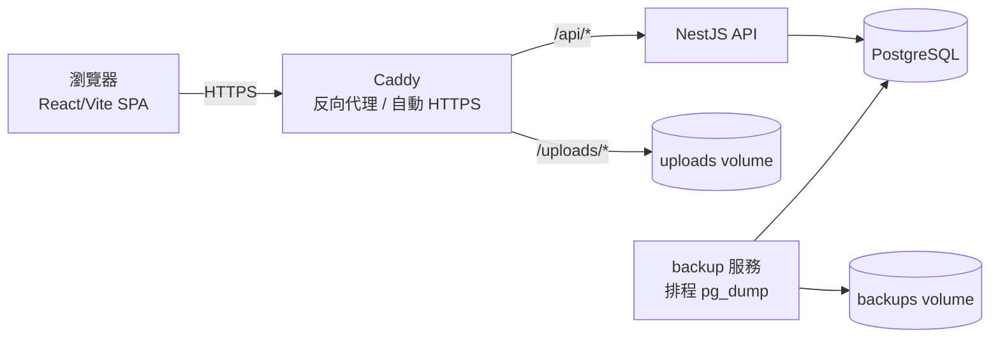
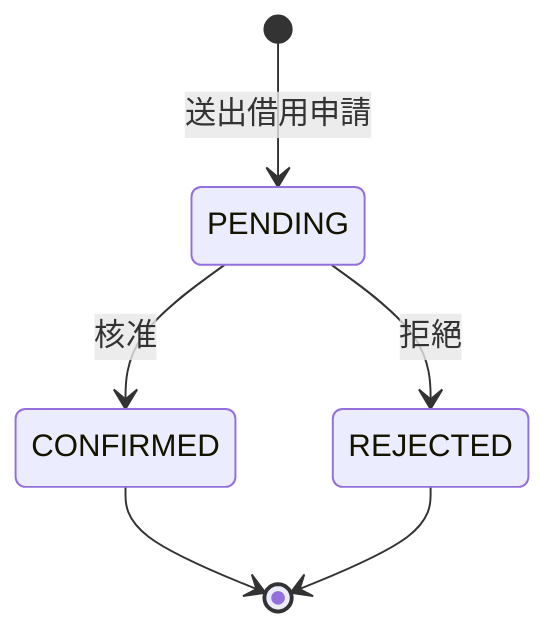

# MeetFix

[](https://nestjs.com/)
[](https://react.dev/)
[](https://www.typescriptlang.org/)
[](https://www.postgresql.org/)
[](https://www.prisma.io/)
[](https://www.docker.com/)

單一學校使用的教室/會議室借用與設施報修追蹤系統。詳細的領域詞彙請見 [`CONTEXT.md`](./CONTEXT.md)，架構決策的來龍去脈請見 [`docs/adr/`](./docs/adr/)。

## 架構



- `backend/` — NestJS REST API，透過 Prisma 存取 PostgreSQL。
- 前端（repo 根目錄）— 既有的 React/Vite 單頁應用程式（SPA）。
- 部署 — 單一 `docker-compose` 堆疊：`api`（NestJS）、`postgres`、`backup`（排程 `pg_dump`）、`caddy`（反向代理，自動 HTTPS）。

## 功能



刪除借用（Booking Deletion）是獨立於上述狀態機的動作：擁有者或 ADMIN 可將任一尚未開始的未來 Booking 從所有畫面中移除（軟刪除），無論其目前狀態為何。`CANCELLED` 狀態僅存在於歷史資料，目前沒有任何動作會產生新的 `CANCELLED` 紀錄。

## 部署

單一 `docker-compose` 堆疊，正式部署完整步驟（環境變數、備份還原、停止/重置）見 [`docs/deploy.md`](./docs/deploy.md)。

快速啟動：
```bash
cp .env.example .env
docker compose up -d --build
```

## 後端開發（不使用 Docker）

```bash
cd backend
npm install
cp .env.example .env       # 將 DATABASE_URL 指向本機 Postgres
npx prisma migrate dev     # 套用／建立 migration
npm run start:dev
```

### 測試

測試對真實 PostgreSQL 執行，不 mock Prisma／DB 層。

```bash
cd backend
# 先將 backend/.env 的 DATABASE_URL 指向可拋棄的 Postgres 實例（本機 Docker 容器即可）
npm run test        # 單元測試
npm run test:e2e    # 針對真實資料庫的 HTTP 邊界測試
```

### 資料庫 migration

Schema 變更一律透過 Prisma migration，絕不手動改資料庫。

```bash
cd backend
npx prisma migrate dev --name <describe-the-change>
```

Migration 檔案提交至 `backend/prisma/migrations/`；正式環境透過 `prisma migrate deploy` 於每次容器啟動時自動套用（見 `backend/docker-entrypoint.sh`）。
