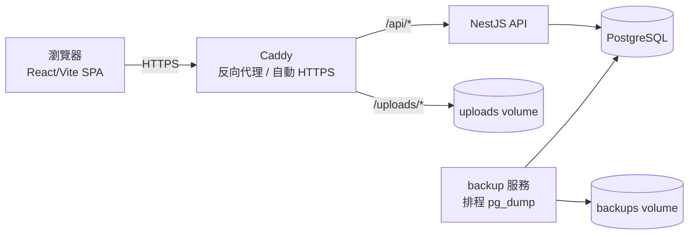
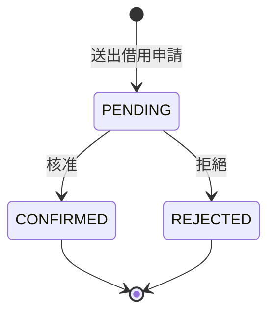

# MeetFix

[](https://nestjs.com/)
[](https://react.dev/)
[](https://www.typescriptlang.org/)
[](https://www.postgresql.org/)
[](https://www.prisma.io/)
[](https://www.docker.com/)

單一學校使用的教室／會議室借用與設施報修追蹤系統。單一部署僅服務一所學校，不支援多租戶。

詳細領域詞彙見 [`CONTEXT.md`](./CONTEXT.md)；架構決策紀錄見 [`docs/adr/`](./docs/adr/)。

## 目錄

- [架構](#架構)
- [功能](#功能)
- [快速開始](#快速開始)
- [本機開發](#本機開發)
- [測試](#測試)
- [資料庫 Migration](#資料庫-migration)
- [部署](#部署)

## 架構



| 元件 | 說明 |
| --- | --- |
| `backend/` | NestJS REST API，透過 Prisma 存取 PostgreSQL |
| repo 根目錄 | React/Vite 單頁應用程式（SPA），為前端 |
| 部署 | 單一 `docker-compose` 堆疊：`api`（NestJS）、`postgres`、`backup`（排程 `pg_dump`）、`caddy`（反向代理，自動 HTTPS） |

## 功能

- **借用（Booking）**：教室／會議室借用申請與審核流程
- **報修（Repair Ticket）**：設施報修單提交與處理
- **角色權限**：`USER` / `FACILITY_MANAGER` / `ADMIN` 三種固定角色（詳見 [`CONTEXT.md`](./CONTEXT.md)）
- **雙重登入**：Google Workspace OAuth 或學校自建帳密

Booking 的狀態機：



刪除借用（Booking Deletion）是獨立於上述狀態機的動作：擁有者或 `ADMIN` 可將任一尚未開始的未來 Booking 從所有畫面中移除（軟刪除），無論其目前狀態為何。`CANCELLED` 狀態僅存在於歷史資料，目前沒有任何動作會產生新的 `CANCELLED` 紀錄。

## 快速開始

以 Docker Compose 啟動完整堆疊：

```bash
cp .env.example .env
docker compose up -d --build
```

正式部署（環境變數、備份還原、停止／重置）完整步驟見 [`docs/deploy.md`](./docs/deploy.md)。

## 本機開發

不使用 Docker，直接對本機 PostgreSQL 開發後端：

```bash
cd backend
npm install
cp .env.example .env       # 將 DATABASE_URL 指向本機 Postgres
npx prisma migrate dev     # 套用／建立 migration
npm run start:dev
```

前端（repo 根目錄）：

```bash
npm install
npm run dev
```

## 測試

不 mock Prisma／DB 層，一律對真實 PostgreSQL 執行：

```bash
cd backend
# 將 backend/.env 的 DATABASE_URL 指向可拋棄的 Postgres 實例（本機 Docker 容器即可）
npm run test        # 單元測試
npm run test:e2e    # 針對真實資料庫的 HTTP 邊界測試
```

前端測試：

```bash
npm run test
```

## 資料庫 Migration

一律透過 Prisma migration 變更 schema，絕不手動改資料庫：

```bash
cd backend
npx prisma migrate dev --name <describe-the-change>
```

- Migration 檔案提交至 `backend/prisma/migrations/`
- 正式環境透過 `prisma migrate deploy` 於每次容器啟動時自動套用（見 `backend/docker-entrypoint.sh`）

## 部署

正式部署完整步驟（環境變數、備份還原、停止／重置）見 [`docs/deploy.md`](./docs/deploy.md)。
